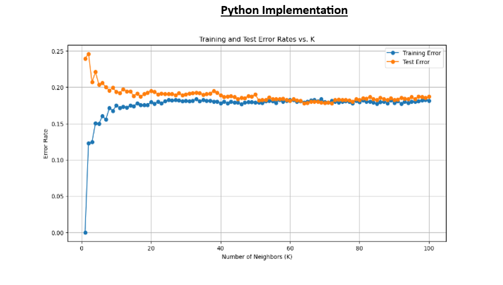
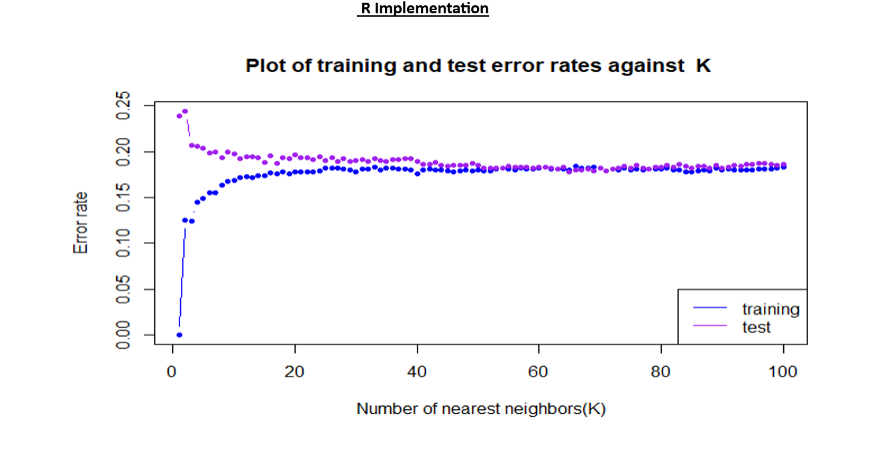
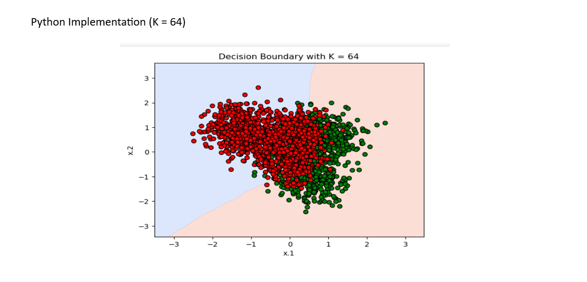
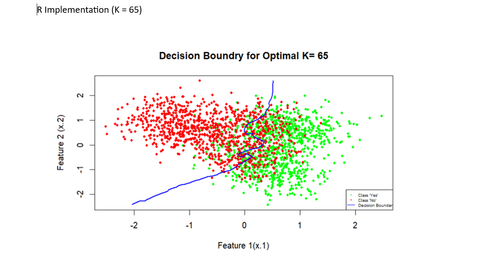

# Mini Project 1: K-Nearest Neighbors (KNN) Classification

## Project Overview

This project implements the **K-Nearest Neighbors (KNN)** algorithm for a binary classification problem using both **Python** and **R**. The objective was to evaluate model performance across different values of **K**, identify the optimal number of neighbors, compare implementations in Python and R, and visualize the resulting decision boundaries.

This project was completed as part of my graduate coursework in **Statistical Machine Learning**.

---

## Project Objectives

* Implement the K-Nearest Neighbors (KNN) classification algorithm.
* Train and evaluate models for **K = 1–100**.
* Compare training and test error rates.
* Identify the optimal K value.
* Visualize decision boundaries.
* Compare Python and R implementations.

---

## Technologies Used

### Programming Languages

* Python
* R

### Python Libraries

* Pandas
* NumPy
* Scikit-learn
* Matplotlib

### Tools

* Jupyter Notebook
* R Markdown
* Git
* GitHub

---

## Repository Structure

```text
mini-project-1-knn-classification
│
├── README.md
├── Data
│   ├── 1-training_data.csv
│   └── 1-test_data.csv
│
├── Images
│   ├── Python_Error_vs_K.png
│   ├── R_Error_vs_K.png
│   ├── Python_Decision_Boundary.png
│   └── R_Decision_Boundary.png
│
├── Python_KNN_Classification.ipynb
├── R_KNN_Classification.Rmd
└── Python_vs_R_KNN_Comparison.pdf
```

---

# Results

## Training and Test Error Analysis

### Python Implementation



### R Implementation



### Observations

Both implementations exhibited similar trends. The training error was lowest at **K = 1** and gradually increased as the number of neighbors increased. The test error initially decreased, reached a minimum near the optimal K value, and then stabilized. These results are consistent with the expected bias-variance tradeoff of the KNN algorithm.

---

## Optimal K Selection

| Implementation | Optimal K | Training Error | Test Error |
| -------------- | --------: | -------------: | ---------: |
| Python         |    **64** |     **0.1790** | **0.1780** |
| R              |    **65** |    **0.18805** | **0.1785** |

Both implementations achieved nearly identical predictive performance, demonstrating consistent behavior across programming languages.

---

## Decision Boundary Analysis

### Python (K = 64)



### R (K = 65)



The decision boundaries generated by Python and R effectively separated the two classes while preserving the overall structure of the data. The Python implementation produced a relatively smooth boundary, whereas the R implementation showed a slightly more irregular boundary. Despite these small differences, both models demonstrated comparable classification performance.

---

## Skills Demonstrated

* Machine Learning
* Supervised Learning
* K-Nearest Neighbors (KNN)
* Classification
* Hyperparameter Tuning
* Model Evaluation
* Python
* R
* Data Visualization
* Statistical Learning

---

## Additional Documentation

A detailed comparison between the Python and R implementations is available here:

[📄 Python vs. R KNN Comparison Report](Python_vs_R_KNN_Comparison.pdf)

---

## Author

**Shradha Upadhyay**

**Interests**

Machine Learning • Data Science • Bioinformatics • Statistical Learning
