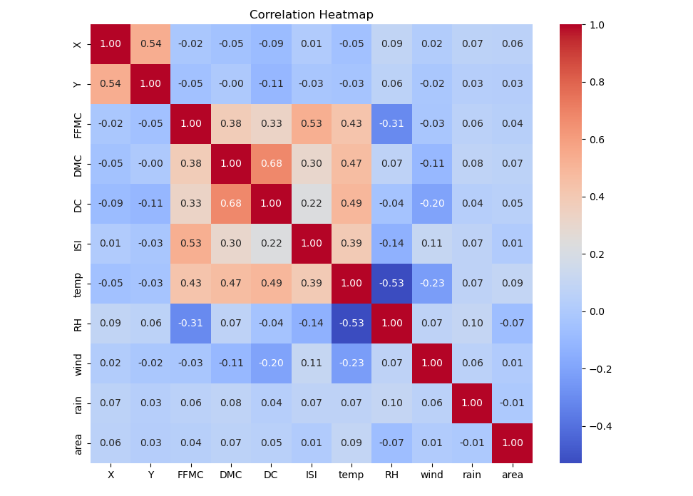
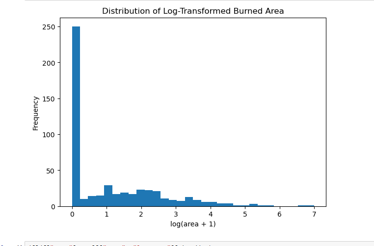
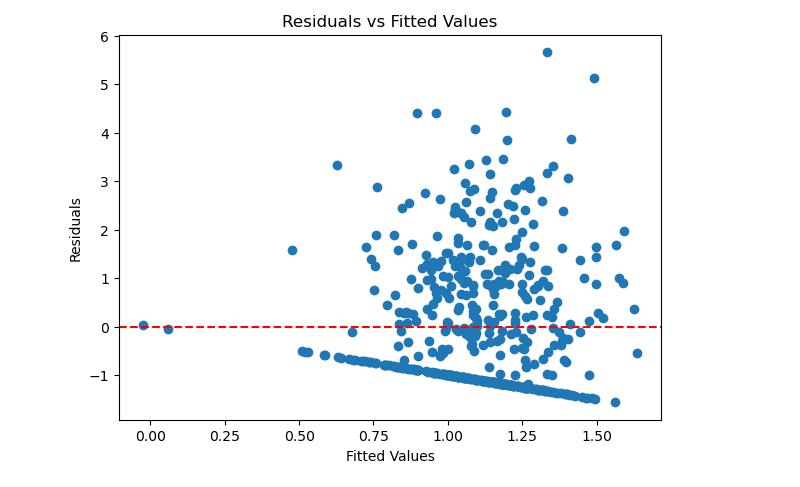
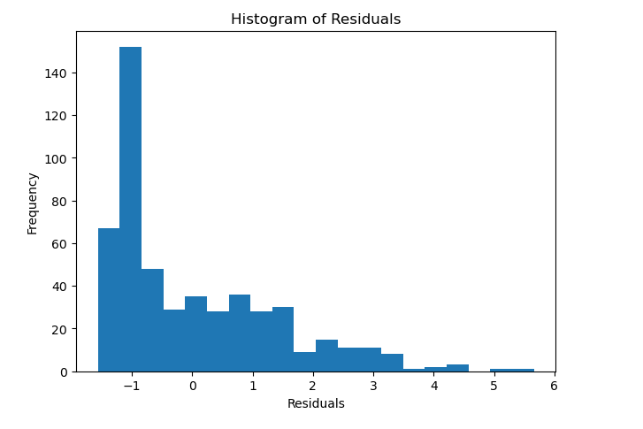
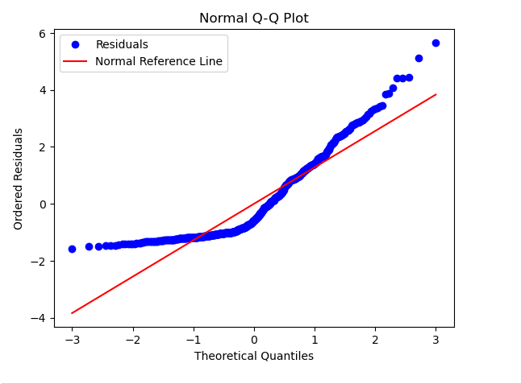
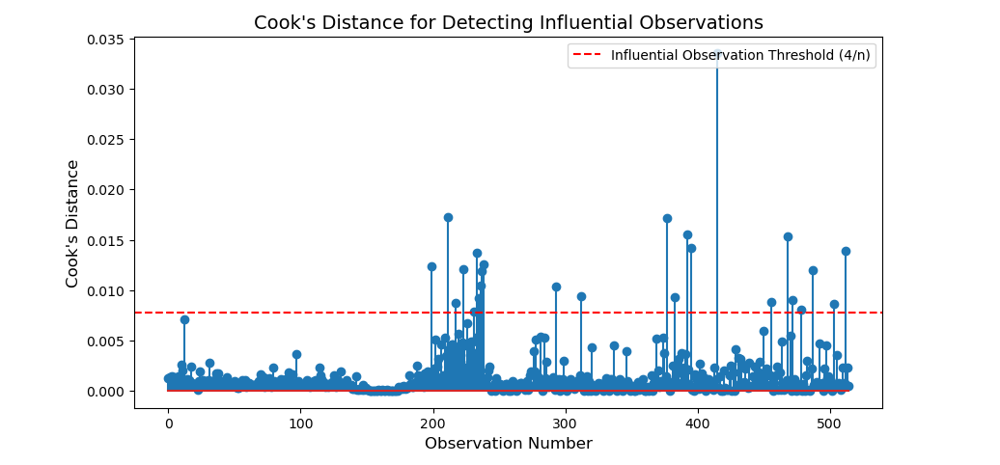

# Mini Project 2: Forest Fire Regression Analysis

## Overview

This project applies exploratory data analysis (EDA) and multiple linear regression to the UCI Forest Fires dataset. The objective was to identify factors associated with forest fire burned area, evaluate regression assumptions, improve the regression model, and predict burned area using the final model.

---

## Dataset

- **Dataset:** UCI Forest Fires Dataset
- **Observations:** 515
- **Response Variable:** `log_area`, defined as `log(area + 1)`

---

## Objectives

- Explore the dataset using summary statistics and visualizations.
- Build simple and multiple linear regression models.
- Include quantitative and categorical predictors.
- Identify statistically significant predictors.
- Evaluate linear regression assumptions.
- Detect influential observations using Cook's Distance.
- Refit the model after removing influential observations.
- Predict burned area using the selected regression model.

---

## Methods

- Exploratory Data Analysis
- Data Visualization
- Correlation Analysis
- Log Transformation
- Simple Linear Regression
- Multiple Linear Regression
- Dummy Encoding for Categorical Variables
- Model Refinement
- Residual Analysis
- Normal Q-Q Plot
- Cook's Distance
- Prediction on the Original Response Scale

---

## Project Summary

### (a) Simple Linear Regression

- Built separate simple linear regression models for each quantitative predictor.
- Evaluated coefficients, p-values, and R² values.
- None of the individual quantitative predictors showed a statistically significant linear association with the log-transformed burned area at the 0.05 significance level.
- The individual models also had very low R² values.

### (b) Multiple Linear Regression

- Built a multiple linear regression model using the available predictors.
- Evaluated the overall F-test and the individual t-tests for regression coefficients.
- In the initial quantitative-only model, wind was the only statistically significant predictor.
- Categorical predictors, including month and day, were later incorporated using dummy variables.

### (c) Exploratory Data Analysis

- Examined data shape, variable types, missing values, summary statistics, and category frequencies.
- Visualized the distribution of burned area and temperature.
- Generated a correlation matrix and heatmap for the quantitative variables.
- Observed that burned area was strongly right-skewed and that most individual predictors had weak correlations with burned area.

### (d) Response Transformation

The original burned-area response was highly right-skewed. A log transformation was applied:

`log_area = log(area + 1)`

Adding 1 allowed observations with zero burned area to be included. The transformation reduced the skewness, although many zero values remained.

### (e) Model Development and Diagnostics

A refined multiple regression model was built using quantitative and categorical predictors. Model quality was evaluated using:

- R²
- Adjusted R²
- AIC
- BIC
- Overall F-test
- Individual coefficient t-tests

Regression diagnostics included:

- Residuals vs Fitted Plot
- Histogram of Residuals
- Normal Q-Q Plot
- Cook's Distance

The diagnostics were used to assess:

- Linearity
- Constant variance
- Normality of residuals
- Influential observations

The residuals showed no strong curved pattern, but they remained right-skewed and deviated from normality in the tails.

### (f) Final Regression Model

The final regression model included quantitative predictors and the categorical variables `month` and `day`.

The categorical variables were represented using dummy variables, with one category treated as the reference level.

In the refined model:

- DMC was statistically significant.
- Temperature was statistically significant.
- December was significantly different from the reference month, April.

### (g) Prediction

For prediction:

- Quantitative predictors were set to their sample mean values.
- The most frequent qualitative categories were selected:
  - **Month:** August
  - **Day:** Sunday

The model predicted:

- **Predicted `log(area + 1)`:** 0.9883
- **Predicted burned area:** approximately **1.69 hectares**

The prediction was converted back to the original scale using:

`area = exp(predicted_log_area) - 1`

### (h) Influential Observation Analysis

Cook's Distance was calculated using the threshold:

`4 / n`

A total of **27 potentially influential observations** were identified.

After removing these observations:

- The number of observations decreased from 515 to 488.
- R² increased from approximately 0.071 to 0.086.
- Adjusted R² increased from approximately 0.026 to 0.043.
- The overall F-test p-value decreased from 0.0428 to 0.0049.

The model was then refitted to assess how influential observations affected the estimated coefficients and overall model fit.

Because influential observations may represent valid extreme forest-fire events rather than data errors, the comparison should be interpreted carefully rather than treating every influential point as an automatic deletion.

---

## Visualizations

### Correlation Heatmap

The heatmap summarizes the linear correlations among the quantitative variables. Most predictors showed only weak correlation with burned area.

---

### Distribution of Burned Area

The original burned-area variable was strongly right-skewed, with many observations near zero and a small number of very large fires.

---

### Residuals vs Fitted Values

This plot was used to assess linearity and constant variance. No strong curved pattern was observed, although the large number of zero burned-area observations produced a visible diagonal band.

---

### Histogram of Residuals

The residual distribution remained right-skewed and included a long positive tail.

---

### Normal Q-Q Plot

The residuals followed the reference line more closely near the center but deviated in both tails, especially the upper tail.

---

### Cook's Distance

Cook's Distance identified observations that had relatively strong influence on the fitted regression model.

---

## Python Libraries

- pandas
- NumPy
- matplotlib
- seaborn
- SciPy
- statsmodels

---

## Skills Demonstrated

- Exploratory Data Analysis
- Data Cleaning and Transformation
- Statistical Visualization
- Correlation Analysis
- Simple Linear Regression
- Multiple Linear Regression
- Categorical Variable Encoding
- Statistical Hypothesis Testing
- Feature Selection
- Regression Diagnostics
- Influential Observation Detection
- Model Comparison
- Predictive Modeling
- Python for Data Science

---

## Files

- **`Forest_Fires_EDA_and_Regression.ipynb`** — Jupyter Notebook containing the complete analysis, code, model results, diagnostics, and prediction.
- **`Forest_Fires_EDA_and_Regression.pdf`** — PDF export of the completed Jupyter Notebook.
- **`forestfires.csv`** — Dataset used in the analysis.
- **`Images/`** — Folder containing the project visualizations.

---

## Future Improvements

- Evaluate predictive performance using a train/test split.
- Compare models using RMSE, MAE, and MSE.
- Apply cross-validation.
- Compare linear regression with Random Forest, Gradient Boosting, and other nonlinear methods.
- Investigate zero-inflated or two-stage modeling approaches because many observations have zero burned area.
